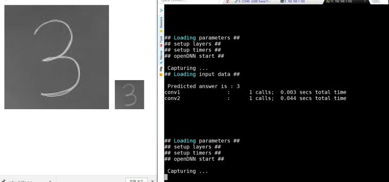

# SC CNN demo
Stochastic computing (SC) based convolutional neural networks (CNNs) implemented on a rather small FPGA chip.

This demo clips were originally created for [IEEE FPT](http://www.icfpt.org/) 2017 conference.

All rights reserved.
